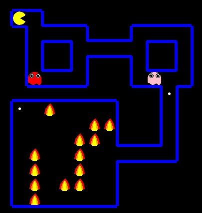
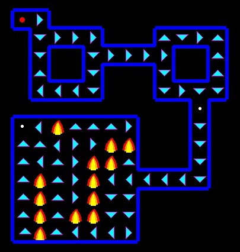

# Masters-Degree-Dissertation
Using machine learning classifiers as shields in game environments to enable safer exploration while training with reinforcement learning algorithms.

# Abstract

This project investigates the use of logical prediction and machine learning classifiers on the 
safety of agents acting under the control of reinforcement learning algorithms in simulated 
environments. See the custom Pacman environment below.

 

The focus of reinforcement learning is often the training of an agent to navigate an unknown 
environment. Due to the expense of this being done in a real-world environment, simulations 
and games are often used. Shields can be used as a safety mechanism to make these agents 
perform exploration in a safer manner by restricting the actions the agent may take. They are 
largely created either by using a priori information or making an off-line model of the 
environment. While these methods are effective, they require either a large amount of 
information about the environment, or a two-stage training in the case of model-based 
shielding. 
The current work aims to overcome these issues by creating a dynamic online shield that will 
learn about the hazards as the agent explores and updates the shield each time a new hazard is 
encountered in real-time, without the need to undertake multiple training runs. This is tested on 
two game environments: Frozenlake and Pacman using tabular and deep learning methods 
respectively. 
In the Frozenlake environment using a q-learning algorithm, a predictive shield, which works to 
simulate the transition dynamics of the environment, performs best but only in a deterministic 
environment. When faced with stochasticity the performance of the shield significantly 
declined. 
In the Pacman environment using a double deep q-learning algorithm, a neural network based 
shield performed best, as this allowed complex relationships between variables and associated 
correlations to be learnt. This allowed the agent to safely navigate the environment with a 
relatively high accuracy in most cases. See below for the route taken for the trained agent.

The promising results in this work could lead towards the development of shields for use in real 
world environments. 

